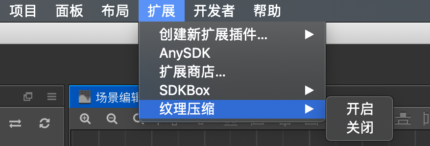
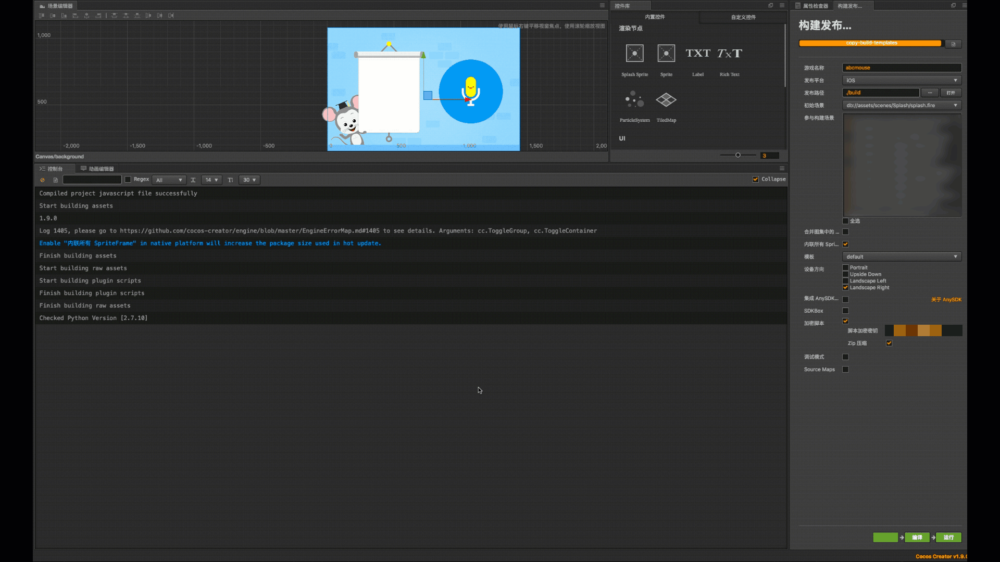
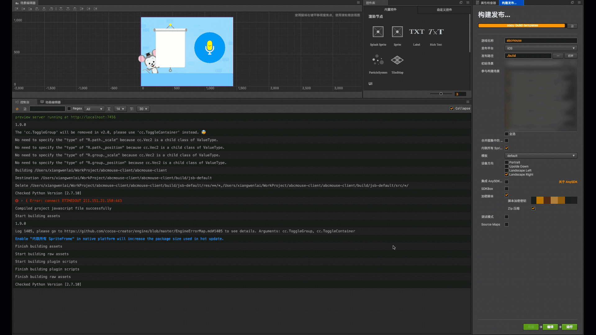

# CocosCreator 纹理压缩插件

## 简介

该纹理压缩工具以CocosCreator插件的形式提供，在Creator构建完成以后自动启动移动端（iOS、Android）资源的纹理压缩，压缩后的格式为`PVR`、`ETC2`、`ETC1`。
压缩完全自动化，不需要手动去触发启动。压缩完成以后，将在`build/jsb-default`或`build/jsb-link`目录下生成压缩以后纹理目录: `packResAndroid`和`packResIOS`

## 特性

* iOS端采用`PVR`和`ETC2`混合的方式压缩，由于PVR压缩对原始纹理的规格限制严格（大小是正方形且边长为2的n次幂），压缩的次序是优选采用PVR, 如果无法使用`PVR`压缩，则使用`ETC2`压缩

* Android采用`ETC`压缩，支持alpha通道

* 为减小安装包的大小，压缩后的纹理再次使用了`gzip`压缩

## 用法

### 工具安装
1. 下载[PowerVRSDK](http://cdn.imgtec.com/sdk/OFFLINE/PowerVRSDKSetup-2018_R2.app.tgz)并安装，安装的时候要勾选上`PVRTexTool`，默认是选上的

2. 下载[MaliTextureTools](https://armkeil.blob.core.windows.net/developer//sitecore/shell/-/media/Files/downloads/texture-compression-tool/Mali_Texture_Compression_Tool_v4,-d-,3,-d-,0,-d-,b81c088_MacOSX_x64.tgz)，并解压到一个本地目录下

### 使用插件

1. 将工程`clone`到本地

2. 修改`packages/texturecompression/toolsEnv.json`文件内容，把里面的两个工具的路径改成实际本地的安装路径(注意，只改安装的路径，SDK内的路径保持不变)。

> 举例:
>
> * PVRTextureTool目录: ` /Applications/Imagination/PowerVR_Graphics/PowerVR_Tools/PVRTexTool/CLI/OSX_x86`，可以不用修改
> * ETC工具的路径: `/Users/xxxxx/Downloads/Mali_Texture_Compression_Tool_v4.3.0.b81c088_MacOSX_x64/bin`, 需要将`/Users/xxxxx/Downloads`替换成自己的目录
>

3. 将`packages`目录拷贝到CocosCreator 工程根目录下 或者拷贝到 `~/.CocosCreator`目录下

4. 启动CocosCreator，启动构建任务，构建完成以后，将自动触发纹理压缩

5. 可以在扩展/纹理压缩菜单下面选择关闭或者开启纹理压缩。如果选择关闭，CocosCreator构建完成以后将不会启动压缩

6. 将Xcode或者Android Studio里面引用的res资源目录，修改成`packResIOS`或者`packResAndroid`下面的res目录

## 性能

纹理压缩支持增量压缩，没有修改过的图片，将直接使用上一次的压缩结果，大大提升压缩速度

* 全量压缩

* 增量压缩

